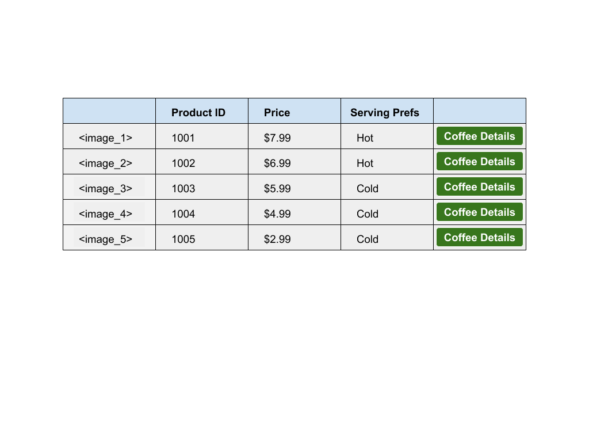

# IS183MidtermFiles

## Midterm Instructions (PART 2): 
A week ago, you decide to earn additional money to buy books for next semester and created professional profile on freelancer.com. You had place a few bids on some website projects you think you can deliver on time and on budget. Today, you received an email from freelancer.com informing you that you have won one of those bids. The client (Gourmet Coffee & Tea) wish to move fast on this project and ask you to start immediately. The email provided by freelancer.com includes project specifications and theme colors. 

Your task is to deliver the website according to the project specs.

The website specifications includes the following:

## Theme Color:
Primary Color: #9BC1BC
Secondary Color: #F4F1BB
Accent Color: #E6EBE0

## Login Form: `(20 pts total)`
1. Single column layout with a login form with username and password input text field. `(10 pts)`
2. Submit button. `(10 pts)`
3. Perform login logic and bind function to onclick event. `(5 pts extra credit)`
4. Redirect to home page on login success. `(5 pts extra credit)`

## Home Page:  `(20 pts total)`
1. Header (with a logo of the business located within the img folder. The file name is sm_logo). The background color is <Primary Color>  `(2.5 pts)`
2. Footer (with copyright text and disclaimer text stating "For educational purpose only! No orders shall be fulfilled"). The background color is <Primary Color>. Font color is <Secondary Color>. Center align all text. `(2.5 pts)`
3. Left sidebar (with working links to all your other pages e.g home, about, contact us, product and login) Link color is <Secondary Color>. No underlines. `(5 pts)`
4. Right sidebar with recent product listings `(5 pts)`
5. Main content area (must include at least a `<h1>` heading font color is <Secondary Color>, 5 `
` paragraph. Font color is <Secondary Color>, and at least 6 `` images displayed as a table OR a gallery) `(5 pts)`

## About Us Page  `(20 pts total)`
1. A one column layout web page with company description and information `(5 pts)`
2. Header (with a logo of the business located within the img folder. The file name is sm_logo). The background color is <Primary Color> `(2.5 pts)`
3. Footer (with copyright text and disclaimer text stating "For educational purpose only! No orders shall be fulfilled"). The background color is <Primary Color>. Font color is <Secondary Color>. Center align all text. `(2.5 pts)`
4. At least three `
` paragraph. Font color is <Accent Color> `(5 pts)`
5. At least one `` image displayed on page.  `(5 pts)`

## Contact Us Page  `(20 pts total)`
1. A one column layout page with a contact form.  `(5 pts)`
2. Header (with a logo of the business located within the img folder. The file name is sm_logo). The background color is <Primary Color> `(2.5 pts)`
3. Footer (with copyright text and disclaimer text stating "For educational purpose only! No orders shall be fulfilled"). The background color is <Primary Color>. Font color is <Secondary Color>. Center align all text. `(2.5 pts)`
4. Contact form should collect first name, last name and email of the user. `(5 pts)`
5. Submit button. (Submit button will redirect to home screen). `(5 pts)`

## Product Grid Page  `(20 pts total)`
1. A two column layout webpage with a table of all your coffee listings. (see specs below) Images are provided in the img folder. `(5 pts)`
2. Left sidebar (with working links to all your other pages e.g home, about, contact us, product and login) Link color is <Secondary Color>. No underlines. `(5 pts)`
3. Header (with a logo of the business located within the img folder. The file name is sm_logo). The background color is <Primary Color> `(5 pts)`
4. Footer (with copyright text and disclaimer text stating "For educational purpose only! No orders shall be fulfilled"). The background color is <Primary Color>. Font color is <Secondary Color>. Center align all text. `(5 pts)`

